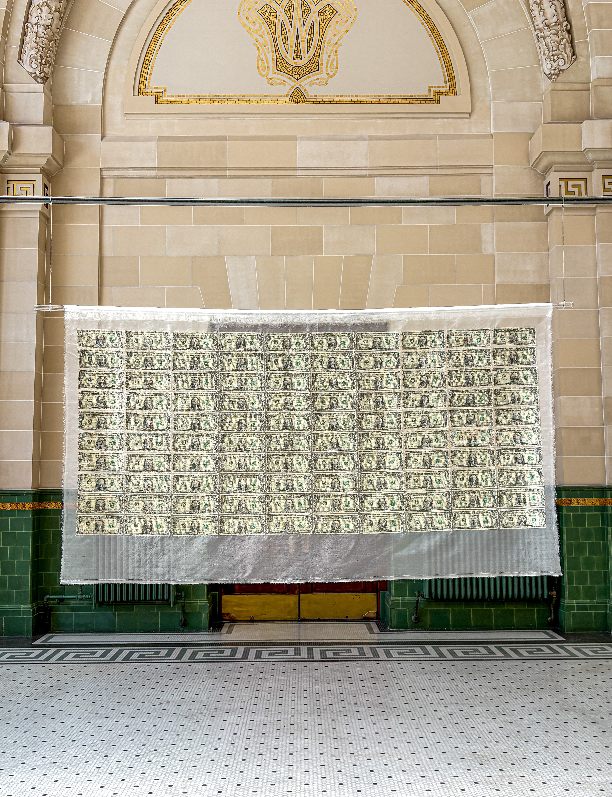

# Meredith Lyon Artist Website — Version 2

This version adds:
- a click-to-enter opening screen
- a translucent currency close-up on entry
- smaller, quieter typography
- a Process section
- placeholders for process photographs, CMYK studies, and video

## Preview
Open the folder in Visual Studio Code and use Live Server:
1. File → Open Folder
2. Select `meredith-artist-site-v2`
3. Right-click `index.html`
4. Choose **Open with Live Server**

## Change the opening image
In `styles.css`, search for:
`background-image: url("assets/1000-front-detail.png");`

Replace the filename with another close-up. A backlit or transparent detail will work especially well.

## Add process images
Put the files in `assets/`, then replace:
`<div class="process-placeholder">Add process image</div>`

with:
``

## Add a local MP4
Replace the video placeholder with:

```html
<video controls playsinline preload="metadata">
  <source src="assets/process-shredding.mp4" type="video/mp4">
</video>
```

Add to `styles.css`:

```css
.process-card video {
  width: 100%;
  aspect-ratio: 4 / 3;
  object-fit: cover;
  background: #111;
}
```

For longer videos, Vimeo or YouTube embedding will load faster.

## Replace the $100 placeholder
Export the main image as `assets/100-installation.jpg`, then replace the placeholder block with:

```html
<figure class="project-main-image">
  
</figure>
```

Confirm whether the design competition was Ralph Pucci or Emilio Pucci before publishing the CV.
